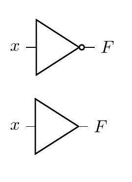
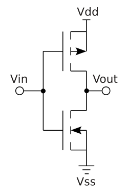

# Session 1: Understanding chip design

Have you ever wondered what powers the millions of electronic devices around
you? Which electrical component kickstarted the digital revolution? Starting
with transistors, then gates, logic blocks and culminating in entire chips, the
semiconductor industry is an amazing feat of humanity. Chips, or Application
Specific Integrated Circuits (ASICs), are hidden everywhere: in Huawei cell
towers, in Samsung RAM memory controllers, and Apple’s M-series chips. They are
so ubiquitous yet they are nearly forgotten and overlooked.

## The basics

So, how's it all done then? First, let's get some terminology sorted. Chip
design, is also known as **IC design**, IC being short for integrated circuit.
You'll see ASIC thrown around as well, which means the same thing, and expands
to application-specific integrated circuit. While ASIC is an all-encompassing
term, it is commonly used to distinguish a chip from a general-purpose
processor, even though a CPU is itself a kind of ASIC. An ASIC is just a chip
that performs _one particular task_.

Next up, we've got EDA. It stands for **electronic design automation** and
refers to the set of software tools that are used to build up circuits,
including both analog and digital. Today's chips are enormously complex; they're
specified at the nanometer level and run at crazy fast speeds (think GHz!). None
of this would be possible without both robust commercial and open source
tooling.

In this course, we'll be using open source EDA, mainly because it's free. Open
source and commercial tools exist in a symbiotic relationship. What open source
tools lack in funding and manpower, they more than make up for agility and
transparency. It turns out that letting bright minds "look inside" does an awful
lot of good. Open source tooling won't help you tape out your next 3nm chip, but
they'll build the engineers that will get you there.

Let's quick fire a few more:

<!-- prettier-ignore-start -->
Tapeout
: The act of finalizing a chip's design and committing it for manufacture at a fab

Fab
: Where highly advanced machinery transforms silicon into full-blown transistors via various processes including etching and lithography. Think TSMC, SMIC, etc.

Bus
: Refers to any multi-bit vector that carries data with well-defined semantics

Fabric
: Also called interconnect. The collection of hardware that orchestrates accesses from masters and responses from slaves. Includes arbiters, decoders, crossbars and more.

7nm, 3nm
: Process nodes. They stopped carrying any significant physical meaning a while ago and now just denote different advances or steppings in semiconductor manufacturing technology.

HDL
: Hardware description language. As the name implies, it _describes_ how hardware is laid out and connected. I cannot emphasize how different it is from software.
<!-- prettier-ignore-end -->

But anyway, what's a chip? A chip is just a big circuit that does _something_.
They're the "pro"" version of the breadboard constructions that we're all used
to making, operating under a completely different set of constraints due to
their manufacturing process. An ASIC might do one thing really well or it might
have a whole host of features that in unison carry out a really complex
function.

ASICs contain physical logic gates, these are the semi-fundamental building
blocks. The gates together execute logic functions, like `A and (B or C)`, where
`A`, `B`, `C` are all digital inputs with some meaning we assign to them.

> [!NOTE]
>
> Certain manufacturing processes might use only one type of gate, like NAND.
> Any arbitrary logic function can be made to use NAND operations (DeMorgan's
> rule).

The key piece of intuition here is to grasp the layers of abstraction involved.
Very roughly, the layers are:

1. Electrons
2. Transistors (pn junctions)
3. Logic gates
4. Flops and logic primitives
5. Functional blocks, e.g. adders
6. Processors/cores
7. Systems-on-chip (SoCs)
8. Firmware / bare metal code
9. Operating Systems
10. Userland applications
11. Web applications

The second piece of intuition is that it's all just circuits. We're designing
circuits with logic gates that carry out a particular _logic function_. This
could be anything. For a CPU, it might be an instruction decoder that generates
corresponding control signals for the rest of the pipeline, for a hardware
accelerator like ours, it's a robust matrix multiplier (matmul).

This brings us nicely to FPGAs. FPGAs are extremely useful in hardware design.
They allow us to, among other things, execute these logic functions at a much
higher speed than in simulation. While ASICs and FPGAs provide us with two
different ways of executing these functions, underneath it all, they are still
the same logic functions.

## Example: an inverter

Let's use an example to tie these concepts together, namely that of an inverter.
An inverter takes a logical input signal and produces its complement; a 1
becomes a 0 and a 0 becomes a 1. In boolean algebra, you'll commonly see a
horizontal bar placed above a variable while in code you'll often see an
exclamation mark (!) placed before a variable to indicate its inversion.

So, at the logic gate level of abstraction, we have the following:

<p style="text-align:center"></p>

> [!NOTE]
>
> The bottom-most symbol is a buffer, a close sibling of the inverter. It simply
> produces the same logic level as seen on its input.

Going down one level of abstraction means implementing this logic function with
transistors. This can be neatly done using CMOS (Complimentary Metal-Oxide
Semiconductor Field Effect Transistor) technology by placing an NMOS transistor
after a PMOS and taking the output from the PMOS-NMOS junction.

<p style="text-align:center"></p>

> [!NOTE]
>
> Recall that a MOSFET has a drain, a gate and a source. Conduction from the
> drain to the source occurs when `V_gate - V_source` exceeds or is below a
> certain threshold. PMOS transistors have an n-type channel while NMOS
> transistors have a p-type channel.
>
> This means that for PMOS, `V_gs` must be negative and below the threshold
> while for NMOS it must be positive and above the threshold. In NMOS
> transistors, electrons flow while in PMOS transistors it is helpful to think
> of holes flowing. Refer to
> [Veritasium's video](https://www.youtube.com/watch?v=IcrBqCFLHIY) on
> transistors for more information.

In this arrangement, a PMOS transistor has its source connected to a positive
supply and its drain connected to the drain of an NMOS whose source is grounded.
The gates of both transistors are connected to a single input `V_in`. Let's
observe the circuit behavior with our two state input:

1. When the input is low, `V_gs` of the NMOS is below 0.7 (typical threshold)
   while that of the PMOS is deeply negative and below its threshold of -0.7
   (PMOS thresholds are negative). PMOS is conducting while NMOS is not.
2. By the same logic as above, the PMOS stops conducting when the input goes
   high and `V_gs` becomes positives and above its threshold. NMOS starts
   conducting, tying the output to ground.

<!-- // {{#circuit circuits/s1-c1.json}} -->

Of course, there still exists one more layer of abstraction but that is left as
an exercise to the reader.

## An odd analogy

Over the years, I've really found the house analogy useful when drawing
parallels between chip design and other processes in the world. A chip is a
house. You need a whole team of people to build you a house: the client, the
architect, the builders, the building inspector. These are all valid roles in
hardware design.

Software is furniture, it can be moved around and different kinds of furniture
can coexist as well as be replaced or upgraded entirely. A house needs furniture
and as such it must be designed to fit the furniture the client had in mind. It
would be absurd to design a house with rooms for 3 fridges, each 3 meters in
height, but equally it would be negligent to build a house without room for any
fridge at all.

## The waterfall model

Chip design follows a roughly sequential process, often called the waterfall
model. Each stage builds upon the previous one, and mistakes become
exponentially more expensive to fix as you progress further down the pipeline.

> [!NOTE]
>
> This is a highly idealized version. The real world does not work like this...!

Here's the typical flow:

**1. Specification**

Everything starts with requirements. What should the chip do? How fast? How much
power can it consume? This phase produces a detailed specification document that
guides all subsequent work.

**2. RTL Design**

Register Transfer Level (RTL) design is where we describe the chip's behavior
using hardware description languages like Verilog or VHDL. We're essentially
writing code that describes digital circuits - registers, combinational logic,
state machines, etc.

**3. Verification**

Before committing to silicon, we need to verify that our design actually works
as intended. This involves writing testbenches, running simulations, and
checking that all corner cases are handled correctly. Industry wisdom says
verification takes 2-3x longer than design itself.

**4. Synthesis**

Synthesis tools take our high-level RTL description and convert it into a
netlist of actual logic gates. The tool chooses from a library of standard cells
(NAND, NOR, flip-flops, etc.) to implement our design while optimizing for area,
power, and timing.

> [!TIP]
>
> You'll see the words power, performance and area a lot. This is called PPA.

**5. Place and Route (P&R)**

Here's where things get physical. The P&R tool takes the netlist and actually
positions all those gates on the chip die, then routes the metal wires
connecting them. This stage must satisfy timing constraints, power delivery
requirements, and manufacturing rules.

**6. Signoff**

Multiple checks ensure the design is ready for manufacturing: timing analysis
(does it meet frequency targets?), power analysis (will it overheat?), design
rule checks (can the fab actually manufacture this?), and more.

**7. Tapeout**

The final design files are sent to the fab. There's no going back after this...
you're committed to manufacturing. If you've screwed up, you and your team
should hold a diode party once the chip comes back.

This is called "tapeout" from the historical practice of literally sending
magnetic tapes to the fabrication facility.

**8. Bringup**

The chips arrive from the fab! Now comes the moment of truth: powering them on
for the first time and seeing if they actually work. Bringup involves testing
basic functionality, debugging any issues that slipped through verification,
getting firmware running, and validating that the silicon matches your
simulations. This phase can range from smooth sailing to months of painful
debugging, depending on how thorough your earlier verification was.

The waterfall nature means that finding a bug late in the process is
catastrophic. A bug found during RTL design might take hours to fix. The same
bug found after tapeout could mean scrapping millions of dollars worth of
silicon.

## Tools

Becoming familiar with the tools, both commercial and open source, is a must.
Here's a few to remember...

### HDLs

Not tools per se but the choice of HDL determines the tools available to you.
Advanced tools will have multiple frontends that can parse different HDLs and
translate them into some intermediate representation.

The most common HDL is SystemVerilog. Verilog and SystemVerilog used to be
different languages but were merged in the IEEE 1800-2009 standard. You might
hear references to Verilog 2001 compatible code, since it's pretty much
guaranteed to work with all EDA tools. This refers to the subset of
SystemVerilog features available in the IEEE Standard 1364-2001.

In this course, we'll be using SystemVerilog (2012 version) since it's what
companies actually use. It's still important for you to know what is and isn't
SystemVerilog since you'll occasionally have to do some archaeology and dig into
some ancient code.

> [!TIP]
>
> Why are some features of SystemVerilog not available or implemented by all
> tools? The reality is that the specification of the language and its
> implementation are two different tasks, with somewhat competing priorities.

- **Verilog/SystemVerilog**: The most widely used HDL in industry. C-like
  syntax, supports both behavioral and structural descriptions
- **VHDL**: More verbose but strongly typed. Common in aerospace and defense

There's a different set of languages, specifically DSLs (domain specific
languages) that enable a different kind of hardware development. These are
so-called high-level HDLs and include Chisel and Amaranth.

### Simulation and Verification

- **Verilator**: Fast, open-source Verilog simulator that compiles to C++
- **ModelSim/QuestaSim**: Industry-standard commercial simulators from Siemens
- **VCS**: Synopsys's commercial simulator, widely used in industry
- **Icarus Verilog**: Open-source Verilog simulator, good for learning

### Synthesis

- **Yosys**: Open-source synthesis tool, excellent for FPGA and ASIC flows
- **Synopsys Design Compiler**: Industry standard commercial synthesis tool
- **Cadence Genus**: Another major commercial synthesis platform

### FPGA Tools

- **Vivado**: Xilinx's (now AMD) complete FPGA design suite for their devices
- **Quartus**: Intel's (formerly Altera) FPGA toolchain
- **nextpnr/Project IceStorm**: Open-source FPGA place and route tools

### Place and Route

- **Cadence Innovus**: Leading commercial P&R tool
- **Synopsys ICC2**: Another major commercial option
- **OpenROAD**: Emerging open-source ASIC flow

### Waveform Viewers

- **GTKWave**: Open-source waveform viewer, works with VCD files from any
  simulator
- **Simvision**: Cadence's waveform viewer
- **Surfer**: Leading open-source option for waveform viewing

### Formal Verification

- **SymbiYosys**: Open-source formal verification tool built on Yosys
- **JasperGold**: Cadence's commercial formal verification platform

The tools in this course will give you a solid foundation in chip design and set
you on the right track to working with commercial EDA tools, since the former
takes inspiration from the latter (the good bits, at least).

## Homework

1. Generate a public SSH key and send it to me
2. Try and SSH into the shared server
3. Download a VNC client and ensure you can access the desktop environment. Make
   sure to configure your own VNC access beforehand.
4. Read through Session 1 to recap content delivered in this session
5. Install the VS Code editor and the remote work extension

## Accessing the shared teaching server

The teaching server is a simple AMD64 Linux box running Ubuntu 24.04 LTS. You
will be asked to hand over your SSH public key. For instructions on creating an
SSH key, see
[this helpful guide](https://docs.github.com/en/authentication/connecting-to-github-with-ssh/generating-a-new-ssh-key-and-adding-it-to-the-ssh-agent?platform=mac).

### SSH access

Once your user is set up, you can log in over SSH:

```bash
ssh <user>@<edaserver>
```

> [!TIP]
>
> Windows users might want to use
> [PuTTY](https://www.chiark.greenend.org.uk/~sgtatham/putty/latest.html)

You'll then be handed a shell, into which you can type anything! Try this:

```bash
echo "hello, world!"
```

SSH is a lightweight protocol that runs over TCP, typically on port 22. It
allows you to remotely connect to servers and access a shell.

### VNC access

You can do plenty on the command line and in fact, I encourage you to stick to
the command line as much as possible. That said, for first forays into chip
design, having a solid grasp of the GUIs EDA tools offer is of paramount
importance.

To access a desktop interface, we'll be using VNC, which is a remote desktop
protocol. The main benefit here is that your windows persist on the teaching
server and you can connect at any time you wish to pick up where you last left
off.

1. Launch an instance of the VNC server

   ```bash
   vncserver :<desktopnum> -geometry 1920x1080 -depth 24 -localhost yes
   ```

   All students will be assigned a desktop number. Please stick to using only
   that number.

   You might get asked to set a VNC password. Keep this short and memorable,
   it's not your main line of defence.

2. Install a VNC client

   Use RealVNC's VNC viewer on macOS and Windows. Or TightVNC, or try both!

3. Forward your VNC port over SSH:

   ```bash
   ssh -N -L <port>:localhost:<port> <user>@<edaserver>
   ```

   Your port is 5900 + `<desktopnum>`.

   Forwarding traffic over SSH is a nifty trick for accessing a remote server's
   network resource on your local machine. It essentially tunnels all traffic to
   a port on your local machine over to the remote machine.

> [!TIP]
>
> Don't know what any of these commands or the flags used mean? Use `man`
> followed by the command to learn more about the command. Or, ask your favorite
> LLM.

4. Connect with your VNC client

   Your server will be `localhost:<port>` and you will be prompted to enter your
   VNC password.

### Misc steps

1. Run this to add the aforementioned open source EDA tools to your `PATH`:

   ```bash
   export PATH="/opt/edatools/oss-cad-suite/bin:$PATH"
   ```

2. Setting up VNC:

   ```bash
   mkdir -p ~/.vnc
   nano ~/.vnc/xstartup
   ```

   Then add the following in your editor:

   ```bash
   #!/bin/bash
   unset SESSION_MANAGER
   unset DBUS_SESSION_BUS_ADDRESS
   exec gnome-session
   ```

   Finally, run:

   ```bash
   chmod +x ~/.vnc/xstartup
   ```
